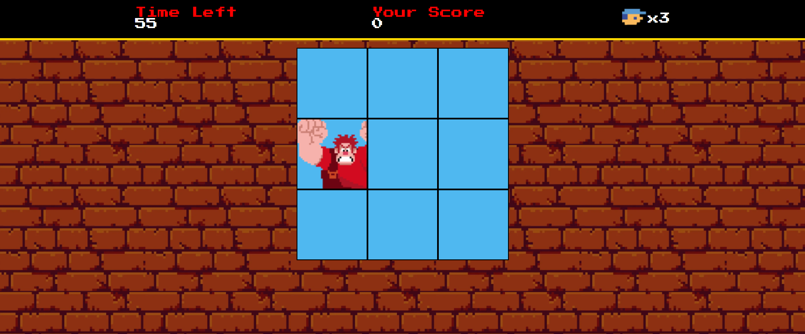

# 🕹️ Detona Ralph - Game Web

Projeto de um mini game inspirado no universo do **Detona Ralph**, onde o jogador deve clicar no Ralph sempre que ele aparecer nos blocos para somar pontos. Criado como prática dos conceitos de **HTML, CSS e JavaScript**, baseado em um projeto da [DIO](https://www.dio.me/).



---

## 🚀 Funcionalidades

- ⏱️ Contagem regressiva de 60 segundos
- 🎯 Pontuação automática a cada acerto
- 💥 Três vidas para errar
- 🔊 Som ao acertar o Ralph (em implementação)
- 👾 Design retrô com estilo 8-bit

---

## 🛠️ Tecnologias Utilizadas

- HTML5
- CSS3
- JavaScript Puro (Vanilla JS)
- Fonte: [Press Start 2P](https://fonts.google.com/specimen/Press+Start+2P)
- Imagens e sprites estilo pixel art

---

## 🧩 Como jogar

1. Clone o repositório:
   ```bash
   git clone https://github.com/ri-beiro/Detona-Ralph-Game.git
